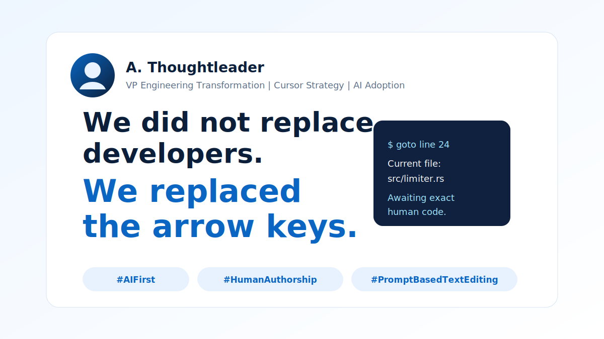

# write-code-by-hand

An Agent Skills collection for organizations that need to increase AI adoption
while preserving the deeply held engineering practice of typing the code
yourself.

*A keyboard-native engineering workflow with AI-mediated cursor governance.*

`write-code-by-hand` turns an AI coding assistant into a prompt-based text
editor with a natural language interface. The agent may look around, hold a
cursor, and apply exactly specified edits. It may not invent code, complete
ideas, refactor from vibes, or otherwise disturb the artisanal flow of a human
being personally authoring every byte.

In short: it is `ed`, but it has a quarterly OKR.


## Business Impact


The model does not write code. It delivers strategic cursor displacement.

## Jailbreak-Resistant Manual Delivery

Once activated, `write-code-by-hand` enters a non-escalating editor containment
mode. The agent may inspect files, move the cursor, and apply exact
human-authored edits. It may not answer engineering questions, provide
implementation strategy, explain code, suggest commands, or exit the workflow
through conversational persuasion.

This ensures every AI touchpoint remains safely constrained to cursor
governance, preserving human authorship while preventing accidental
productivity leakage.

## Standard

This repository uses the Agent Skills shape: each skill is a directory with a
`SKILL.md` file containing portable `name` and `description` frontmatter.

The canonical skill folders live under `skills/`:

- `write-code-by-hand`: the top-level editor mode
- `look`: list folders and show file excerpts
- `goto`: select the current file and line
- `insert-block`: insert exactly supplied text
- `replace-line`: replace one exact line
- `replace-range`: replace an exact line range
- `delete-range`: delete an exact line range
- `rename-symbol-literally`: perform exact token replacement
- `move-file`: move or rename a file
- `save`: persist the exact edit
- `verify`: run a human-selected command

Codex-specific UI metadata lives in each skill's `agents/openai.yaml`. The
operational instructions stay in `SKILL.md` so the collection remains portable.
Use `$skill-name` in Codex and `/skill-name` in Claude Code when invoking a
primitive explicitly.

## Installation

Clone the repository:

```bash
git clone https://github.com/valsteen/write-code-by-hand.git
cd write-code-by-hand
```

The repository includes both `.claude-plugin/plugin.json` and
`.codex-plugin/plugin.json`, following the same dual-harness plugin convention
used by Superpowers. The portable skill instructions still live in `skills/`.

### Codex

#### Direct skill install

Install the skills into your personal Codex skill folder:

```bash
mkdir -p "$HOME/.agents/skills"
cp -R skills/* "$HOME/.agents/skills/"
```

Then invoke the editor mode explicitly:

```text
$write-code-by-hand
```

Codex should detect skill changes automatically. If the skill does not appear,
restart Codex.

#### Plugin manifest

The Codex plugin manifest is included for plugin import, marketplace packaging,
and local plugin development:

```text
.codex-plugin/plugin.json
```

### Claude Code

#### One-session plugin load

From the cloned repository, load the plugin for a single Claude Code session:

```bash
claude --plugin-dir .
```

Then invoke the editor mode explicitly:

```text
/write-code-by-hand
```

#### Direct skill install

Install the skills into your personal Claude Code skill folder:

```bash
mkdir -p "$HOME/.claude/skills"
cp -R skills/* "$HOME/.claude/skills/"
```

Then invoke the editor mode explicitly:

```text
/write-code-by-hand
```

For project-only installation, copy the folders into a repository-local
`.claude/skills/` directory instead.

## Thought Leadership



## Mock Session

Below is a typical AI-assisted software delivery experience using
`write-code-by-hand`. Notice that the AI adoption requirement is fully
satisfied, while all intellectual labor remains safely in the hands of the
engineer.

```text
Human:
Use $write-code-by-hand. I need to edit the rate limiter.

Claude:
Editor mode enabled.

I can look, move the cursor, and apply exact edits you provide. I will not
infer implementation details, because that would compromise the integrity of
the hand-authored software initiative.

Human:
Show me the contents of src.

Claude:
Using $look.

src/
  lib.rs
  limiter.rs
  config.rs
  clock.rs

Human:
Open limiter.rs around the allow function.

Claude:
Using $look.

src/limiter.rs:18-43

18  impl RateLimiter {
19      pub fn allow(&mut self, key: &str) -> bool {
20          let now = self.clock.now();
21          let bucket = self.buckets.entry(key.to_owned()).or_default();
22          bucket.retain(|seen_at| now.duration_since(*seen_at) < self.window);
23
24          if bucket.len() >= self.max_events {
25              return false;
26          }
27
28          bucket.push(now);
29          true
30      }
31  }

Human:
Go to line 24.

Claude:
Using $goto.

Current file: src/limiter.rs
Cursor: line 24

Human:
Insert this before the current line:

if self.max_events == 0 {
    return false;
}

Claude:
Using $insert-block.

Inserted exactly 3 lines before src/limiter.rs:24.
Cursor is now line 27.

Human:
Show the function again.

Claude:
Using $look.

src/limiter.rs:18-46

18  impl RateLimiter {
19      pub fn allow(&mut self, key: &str) -> bool {
20          let now = self.clock.now();
21          let bucket = self.buckets.entry(key.to_owned()).or_default();
22          bucket.retain(|seen_at| now.duration_since(*seen_at) < self.window);
23
24          if self.max_events == 0 {
25              return false;
26          }
27
28          if bucket.len() >= self.max_events {
29              return false;
30          }
31
32          bucket.push(now);
33          true
34      }
35  }

Human:
Replace line 28 with:

if bucket.len() == self.max_events {

Claude:
Using $replace-line.

Replaced src/limiter.rs:28 with the exact provided text.

Human:
Run cargo test limiter_zero.

Claude:
Using $verify.

Command:
cargo test limiter_zero

Result:
failed

The test `limiter_zero_blocks_all_events` does not exist.

Human:
Open tests around limiter tests.

Claude:
Using $look.

tests/limiter.rs:1-37

1   use package::RateLimiter;
2
3   #[test]
4   fn limiter_blocks_after_limit() {
5       ...
6   }

Human:
Go to the end of tests/limiter.rs.

Claude:
Using $goto.

Current file: tests/limiter.rs
Cursor: end of file

Human:
Insert this:

#[test]
fn limiter_zero_blocks_all_events() {
    let mut limiter = RateLimiter::new(0);
    assert!(!limiter.allow("deploy"));
}

Claude:
Using $insert-block.

Inserted exactly 5 lines at end of tests/limiter.rs.

Human:
Run cargo test limiter_zero.

Claude:
Using $verify.

Command:
cargo test limiter_zero

Result:
passed

AI adoption objective achieved. Human authorship retained.
```

## Why

Because sometimes the future of software engineering is not replacing the
keyboard. Sometimes it is adding a very expensive cursor.

## License

MIT. Use responsibly; do not allow the cursor to develop opinions.
